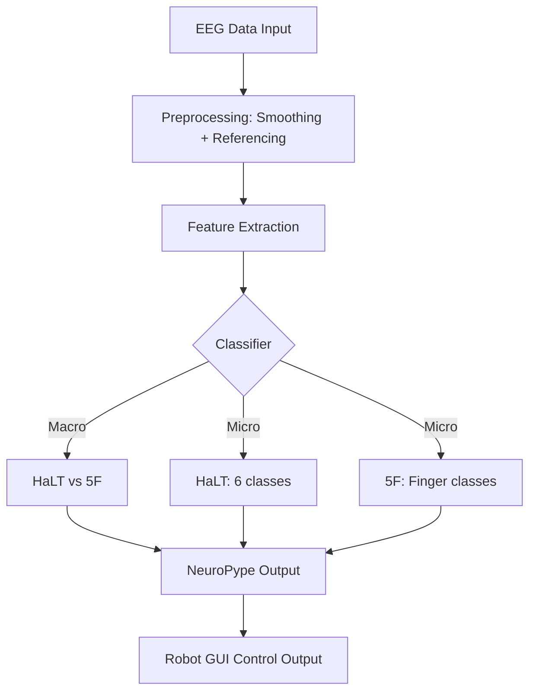
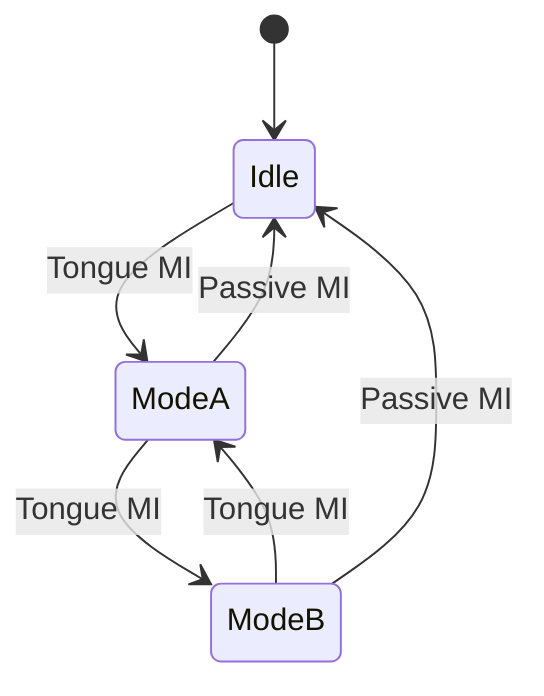

What if you could control a robot just by thinking?

In our **Motor Imagery BCI project**, we used EEG recordings to let users control a virtual humanoid robot arm and hand through imagined movements. Using two paradigms—**HaLT** (Hand, Leg, Tongue) and **5F** (Five Fingers)—we decoded users’ mental states into robot commands for both macro and micro motion control.

## Project Highlights

- Built on one of the largest EEG datasets: 60+ hours across 13 subjects and 60,000+ motor imagery (MI) examples.
- Developed three classifiers:
  1. **Binary Classifier** – Distinguish HaLT vs. 5F
  2. **Intra-HaLT Classifier** – Recognize one of 6 limb/tongue/passive states
  3. **Intra-5F Classifier** – Recognize individual fingers (1–5)
- Used:
  - Raw EEG
  - Power Spectral Density (PSD)
  - Fourier Transform Amplitudes (FTA)
  - Savitzky-Golay smoothing
- Integrated the classifier output with a **robot control GUI** via TCP and **NeuroPype** pipelines.

## NeuroPype Mindmap

```markmap {height="220px"}
- BCI Pipeline
  - Data Source
    - EEG Dataset (HaLT & 5F)
  - Preprocessing
    - Savitzky-Golay smoothing
    - Common Average Referencing
    - Segment cropping (0–0.85s)
  - Feature Extraction
    - PSD (Welch)
    - FTA (Fourier Transform)
  - Classifiers
    - SVM (linear)
    - Neural Net (exploratory)
  - Control Interface
    - NeuroPype pipeline
    - TCP GUI for robot
```

## Classification Results

{}
Even with simple linear SVMs, our system achieved above-chance classification across all subjects.
{}

- **Macro (HaLT vs. 5F)**: up to 98% accuracy
- **Intra-HaLT**: up to 98% (FTA features most effective)
- **Intra-5F**: up to 70% (lower but usable for simple gestures)

## Robot Control in VR

The robot responds to:
- **Macro Movement (HaLT)**: X-Y-Z motion & wrist rotation
- **Micro Movement (5F)**: individual fingers toggle open/close

Mode switching (e.g., between X-Y and Z/rotation) is triggered by **tongue motor imagery**.

## System Visualization

```markmap {height="200px"}
- Outputs
  - Raw EEG with markers
  - Power Spectrum
  - Classification Plot
  - TCP command to GUI
```

Each component of our pipeline—from preprocessing to robot motion—was visualized and validated through the NeuroPype framework.

## Final Thoughts

We demonstrated a low-latency, high-accuracy BCI framework for robotic limb control using only non-invasive EEG. This project shows promising implications for virtual prosthesis training, assistive robotics, and next-gen neurotechnology.

---

<!-- 🙌 Like what you see? Consider connecting with us on [GitHub](https://github.com/ChawinOph) or [Google Scholar](https://scholar.google.com/citations?user=yRCm1skAAAAJ). -->

## Diagrams

Hugo Blox supports the _Mermaid_ Markdown extension for diagrams.

### BCI Control Flow



### State Transition for Robot Control Modes


